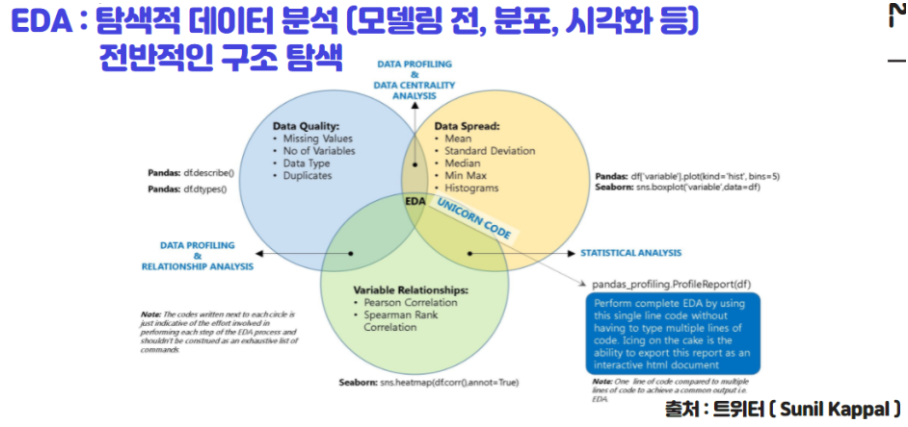
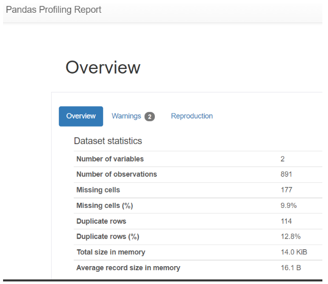
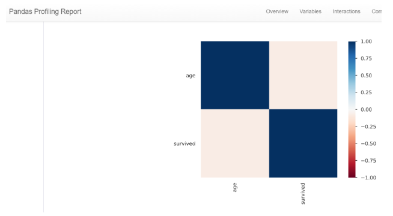

# 전처리 & EDA

## 전처리란?
- 수집된 데이터의 가공 없이 데이터 분석 및 모델링을 하면 결과가 이상하게 나올 수 있음. 데이터를 분석에 사용할 수 있도록 정제하고 가공하고 변환해서 모델링에 필요한 변수로 만드는 과정

## EDA란?
- 데이터 모델링에 들어가기 전에, 수집된 데이터의 분포, 관계를 파악하는 과정

1) Data Spread(기술통계 영역)
- Mean, Median, Mode
- Standard Deviation Variance

2) Data Quality(데이터 품질)
- Missing Value
- Outlier
- Data Type
- Duplication

3) Variable Relations(변수 상관성)
- Pearson Correlation
- Spearman Rank Correlation

## EDA 파이썬

- 파이썬의 판다스 라이브러리로 보고서를 불러 오면 Variable, Missing Cells, Duplication Row 등등 을 한 눈에 보기 쉽게 정리해서 보고서로 볼 수 있다.

- 변수 간의 Correlation 등을 시각화해서 한 눈에 보기 쉽게 얼마나 관련성이 있는지 볼 수 있다.

데이터 분석에 들어가기 앞서, EDA 과정을 통해서 변수를 사용해도 모델링 결과에 큰 문제가 없는지, 결측값, 이상값 들이 많이 있지는 않은지 중복 데이터는 얼마나 존재하는지 등등을 미리 파악하고 다시 한번 데이터의 정제, 가공이 필요한지 확인할 수 있다.

## 데이터 전처리

- 데이터 전처리 과정에서는 이상값 처리, 결측값 처리, 변수 변환, 과적합 등등을 해주어서 데이터를 정제하고 모델링에 사용 될 수 있도록 해야된다.