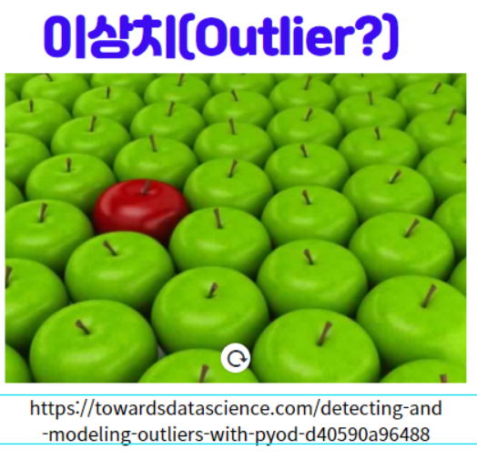
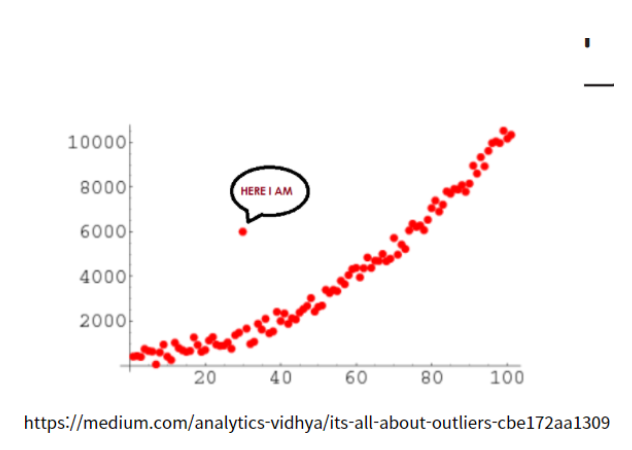
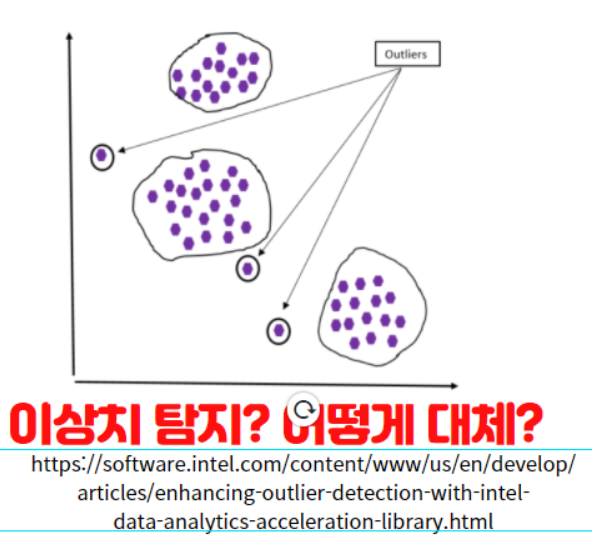

# 데이터 전처리

## 결측치란?

- 값이 비어 있는 데이터를 의미
- 아예 공란으로 되어 있거나, NA, NaN, Null 등으로 표현

## 이상치란?

- 일반적인 데이터 값에서 벗어난 값
- 추세에서 많이 벗어난 값

## 결측치 이슈

### 결측치 종류(MCAR/MAR/MNAR)

### 결측치 처리(삭제/단순대체/다중대체)

## 이상치 이슈

### 이상치 탐지(모수적/비모수적)

### 이상치 처리

## 결측값, 이상값 처리가 필요한 이유

- 데이터의 결측이 발생하거나 이상값이 발생할 경우 Machine Learning 등 데이터 분석 모델링 결과에 왜곡 또는 편향된 결과를 도래할 수 있다. 따라서 데이터 전처리와 EDA 과정을 통해서 분포를 파악하고 데이터를 다시 정제해서 예측되는 모델링 결과에 부합되는 데이터를 만들어야 되기 때문에