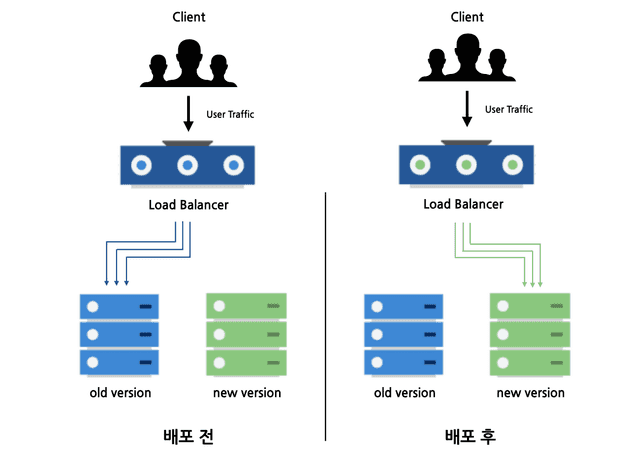
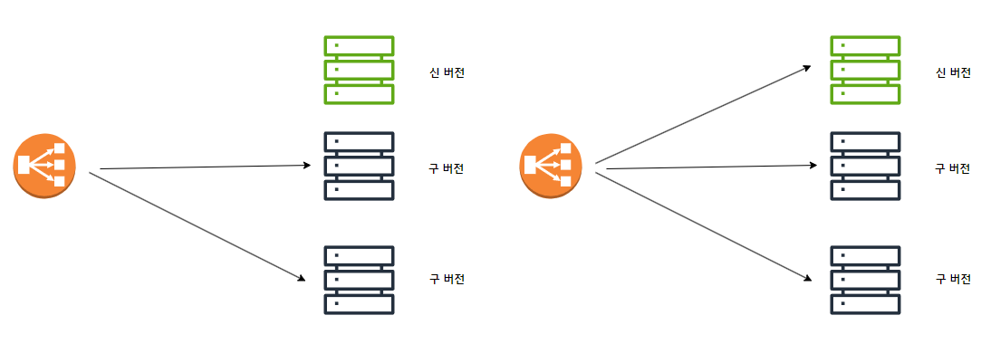
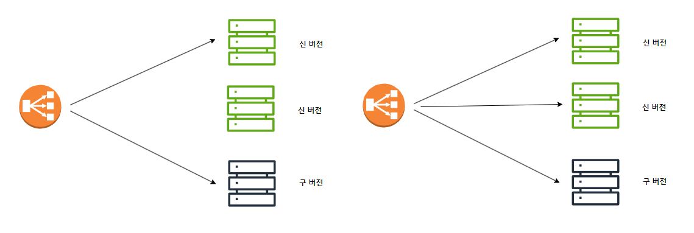
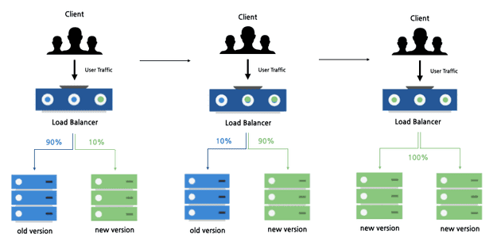

# 무 중단 배포

## Blue/Green 배포
    


```
장점
- 트래픽을 모두 새로운 버전으로 옮기기 때문에호환성 문제가 발생하지 않는다.
단점
- 실제 운영에 필요한 서버 리소스 대비 2배의 리소스를 확보해야한다.
```

## Rolling 배포





```
장점
- 많은 서버 자원을 확보하지 않아도 무중단 배포가 가능하다.
- 인스턴스마다 차례로 배포를 진행하기 때문에 배포로 인한 위험이 줄어든다.
단점
- 새 버전을 배포할 때 배포 도중 서비스 중인 인스턴스 수가 줄어, 각각의 서버가 부담하는 트래픽 양이 증가하게 된다.
- 배포가 진행되는 동안 구버전과 신버전이 공존하기 때문에 호환성 문제가 발생할 수 있다.
```

## Canary 배포



```
장점
- 실제 사용자 테스트와 무중단 배포를 동시에 할 수 있다
- 새로운 버전으로 인한 위험을 최소화 할 수 있다.
단점
- 롤링 배포와 마찬가지로 두 버전이 함께 존재하기 때문에 호환성 문제가 발생할 수 있다.
```