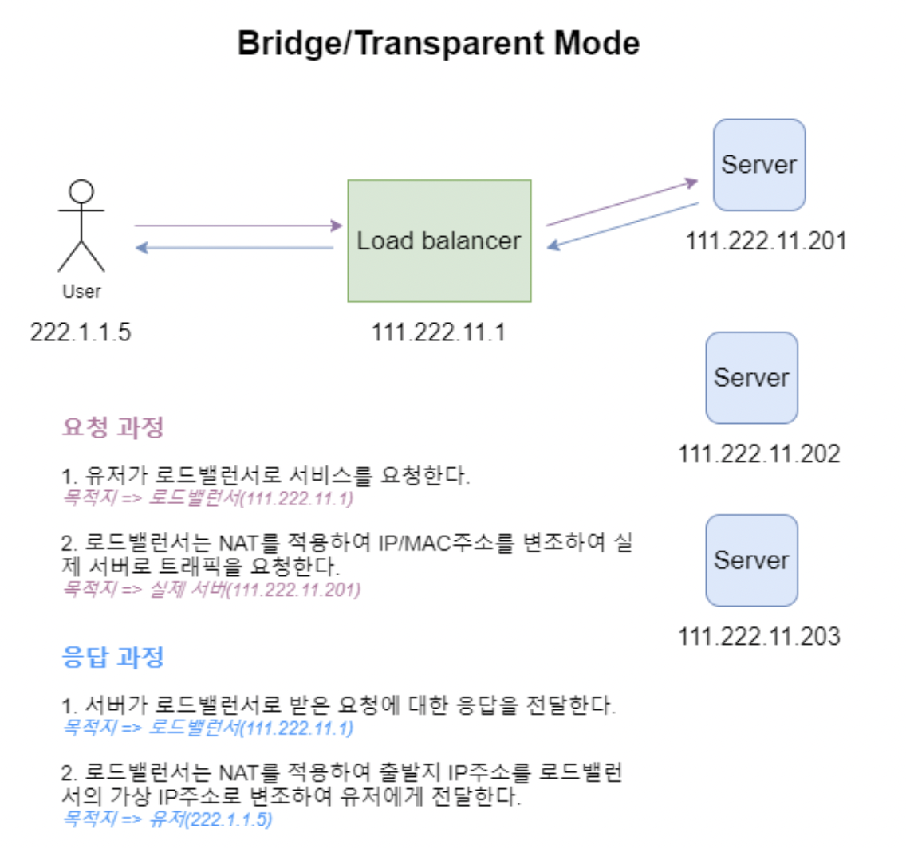

# 로드밸런싱과 클러스터링

## 로드 밸런싱

- 로드밸런싱이란 처리해야 할 업무 혹은 요청을 나누어 처리하는 것을 의미
- 사용자로부터 들어오는 다수의 요청을 서버들에게 적절하게 배분하여 서버들로 하여금 분산된 요청을 처리하게 하는 것을 뜻함
- 로드밸런싱은 요청을 서버가 직접 받는 것이 아닌 Network Switch(L4/L7 Switch) 또는 Load Balancer가 담당한다.

### 로드 밸런서의 주요 기능

1. NAT(Network Address Translation)

    Private IP를 Public IP로 바꿔주는 통신망의 주소 변조기

2. Tunneling
    
    눈에 보이지 않는 통로를 만들어 통신할 수 있게 하는 개념
    데이터를 캡슐화하여 연결된 노드만 캡슐을 해제할 수 있게 만든다.

3. Dynamic Source Routin protocol(DSR)
    
    요청에 대한 응답을 할 때 로드 밸런서가 아닌 client IP로 응답
    즉, 네트워크 스위치를 거치지 않고 바로 클라이언트를 찾아가는 개념

### L4, L7 Switch

OSI 7 Layers에서 각 계층이 L1 ~ L7 계층에 해당된다. 상위 계층에서 사용되는 장비는 하위 계층의 장비가 갖고 있는 기능을 모두 가지고 있으며, 상위 계층으로 갈수록 더욱 정교한 로드밸런싱이 가능하다.

1. L4

    네트워크 계층이나 트랜스포트 계층의 정보를 바탕(IP, Port)으로 로드를 분산시킨다.

2. L7

    애플리케이션 계층(HTTP, FTP, SMTP)에서 로드를 분산하기 때문에 HTTP 헤더, 쿠키 등과 같은 사용자의 요청을 기준으로 특정 서버에 트래픽을 분산한다.
    (패킷의 내용을 확인하고 그 내용에 따라 로드를 특정 서버에 분배하는 방식) 때문에 L4보다 요청을 보다 세분화해 전달할 수 있다. 콘텐츠 기반 스위칭이라고도 한다.

3. 차이

    L7 스위치는 데이터를 분석해 처리가 가능하기 때문에 악의적이거나 비정상적인 콘텐츠를 감지해 보안 지점을 구축할 수 있는 장점이 있지만, 그만큼 자원 소모가 크다는 단점이 있다.

## 클러스터링

- 여러 대의 컴퓨터를 병렬로 연결한 시스템
- 여러대의 컴퓨터를 가상의 하나의 컴퓨터처럼 사용하게 해주는 것
- 특정 장비에 문제가 생겨도 전체 서비스에 영향을 주지 않게 하기 위해 failover 적용

### 이중화

    이중화란 운영 중인 서비스의 안정성을 위해 각종 자원을 이중 또는 그 이상으로 구성하는 것을 말하며, 클러스터링의 기본적인 기술이다.

### Fail Over

    장애가 일어난 Active 서버를 내리고 대기하고 있던 StandBy 서버를 올리는 것을 말한다. 보통 네트워크 장애 발생 시 노드 간 fail over가 실행되도록 설정했다고 말한다.
    fail over 발생 시 active 서버에 할당한 가상 ip주소를 제거하고 StandBy 서버에 해당 주소를 재할당하기 때문에, 클라이언트는 동일한 IP주소로 그대로 접속이 가능하다.

## 로드밸런싱과 클러스터링의 차이

    둘 다 분산환경을 구축하는 것에 있어 차이가 없어보일 수 있으나 클러스터링은 한 서비스를 제공하는 여러 개의 서버를 하나로 묶어 성능을 높여 많은 패킷을 감당하는 형식이고 로드밸런싱은 여러 대의 서버에 이 패킷을 분산시켜주는 것을 목표로 한다는 것에 차이가 있다.